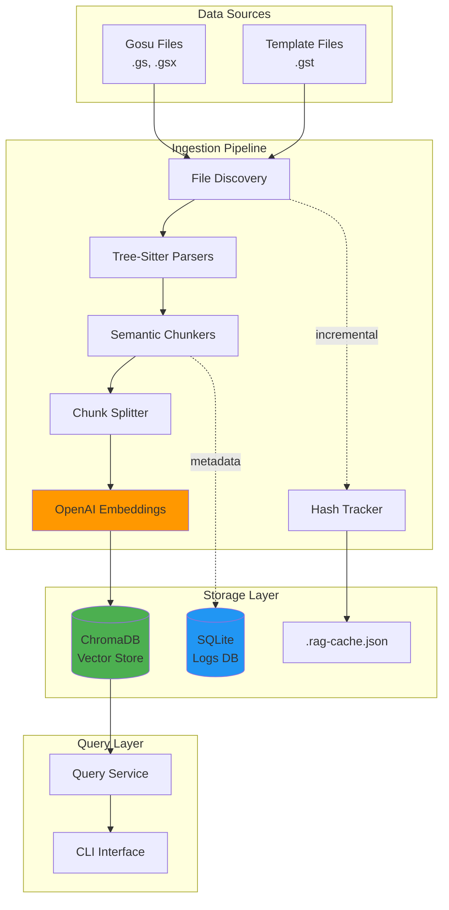
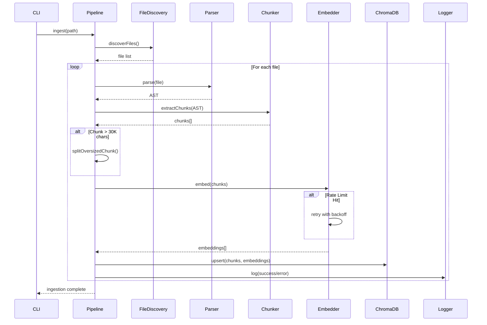
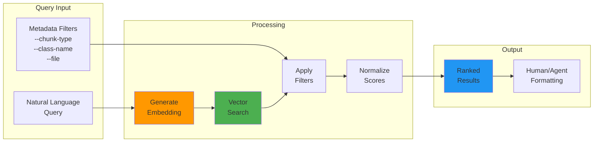

# Guidewire RAG Ingestion Platform

**Production-grade semantic search and retrieval system for Guidewire Gosu codebases**

[](https://www.typescriptlang.org/)
[](https://www.trychroma.com/)
[](https://openai.com/)

## 📊 Performance Metrics

**Latest Full Ingestion:**
- **Files Processed:** 5,619
- **Chunks Created:** 75,621
- **Success Rate:** 100% (0 errors)
- **Processing Time:** 440 seconds (~7.3 minutes)
- **Average:** ~13 chunks/file, ~172 chunks/second

---

## 🎯 Features

### Core Capabilities
- ✅ **Semantic Chunking**: AST-based extraction of classes, functions, properties, and uses statements
- ✅ **Dual Language Support**: Gosu (.gs, .gsx) and Gosu Template (.gst) files
- ✅ **Smart Chunk Splitting**: Automatic splitting of oversized chunks with configurable overlap
- ✅ **Incremental Ingestion**: Hash-based caching skips unchanged files
- ✅ **Production Hardening**: Exponential backoff, rate limit handling, comprehensive error tracking
- ✅ **Metadata Filtering**: Query by chunk type, class name, file path, package
- ✅ **Persistent Storage**: ChromaDB with Docker-based deployment

### Advanced Features
- 🔄 **Retry Logic**: 10 attempts with exponential backoff for OpenAI API
- 📝 **Comprehensive Logging**: SQLite-based event tracking with session management
- 🎨 **Configurable Semantic Units**: Customize which AST nodes to extract via `.env`
- 🔍 **Hybrid Search**: Combine semantic similarity with metadata filters
- 📊 **JSON Reports**: Detailed ingestion statistics and error analysis

---

## 🏗️ Architecture

### System Overview



### Ingestion Flow



### Query Architecture



---

## 🚀 Quick Start

### Prerequisites

- Node.js 18+ and npm
- Docker and Docker Compose
- OpenAI API key
- **Build tools** (required for native dependencies)

### Build Requirements

This project uses native Node.js modules (`better-sqlite3`, `tree-sitter`) that require compilation during installation.

**macOS:**
```bash
xcode-select --install
```

**Linux (Ubuntu/Debian):**
```bash
sudo apt-get install -y build-essential python3
```

**Linux (Fedora/CentOS):**
```bash
sudo yum install gcc-c++ make python3
```

**Windows:**
- Install [Visual Studio Build Tools](https://visualstudio.microsoft.com/downloads/#build-tools-for-visual-studio-2022)
- Or install via chocolatey: `choco install visualstudio2022buildtools`

### Installation

```bash
# Clone the repository
git clone https://github.com/yourusername/gosu-chroma-rag.git
cd gosu-chroma-rag

# Install dependencies
npm install

# Copy environment template
cp .env.example .env

# Edit .env and add your OpenAI API key
nano .env
```

### Configuration

Edit `.env`:

```bash
# Required
OPENAI_API_KEY=your-api-key-here
SOURCE_PATH=./gsrc

# Optional (defaults shown)
EMBEDDING_MODEL=text-embedding-3-small
EMBEDDING_DIMENSIONS=1536
CHUNK_SIZE=8000
CHUNK_OVERLAP=200

# Semantic Units (comma-separated)
GOSU_SEMANTIC_UNITS=uses_statement,class_declaration,interface_declaration,enum_declaration,enhancement_declaration,function_declaration,property_declaration
GOSU_TEMPLATE_SEMANTIC_UNITS=directive,scriptlet,expression,declaration
```

### Start ChromaDB

```bash
docker compose up -d
```

### Run Ingestion

```bash
# Full ingestion from SOURCE_PATH
npm run ingest

# Ingest specific directory
npm run ingest ./gsrc/nz/co/acc

# Ingest single file
npm run ingest ./gsrc/nz/co/acc/account/AccountEnhancement_ACC.gsx

# Clean cache and re-ingest
npm run clean-ingest
```

---

## 🔍 Querying

### Simple Semantic Search

```bash
# No filters
npm run query "policy location" 2>/dev/null
npm run query "uses gw api" 2>/dev/null
npm run query "validatePrimaryAddressState" 2>/dev/null
```

**Output:**
```
📊 Found 5 results:

1. Score: 41.7%
   📁 nz/co/acc/account/AccountEnhancement_ACC.gsx
   📝 Type: file
   📍 Lines: 5-5
   💬 "uses gw.api.database.Query"
```

### Filtered Queries

Use `npx ts-node` for metadata filters:

```bash
# Filter by chunk type
npx ts-node src/cli/index.ts query "uses" --chunk-type file --top-k 20 2>/dev/null

# Filter by file path (partial match)
npx ts-node src/cli/index.ts query "account" --file AccountEnhancement --top-k 10 2>/dev/null

# Filter by class name
npx ts-node src/cli/index.ts query "validate" --class-name AccountEnhancement_ACC --chunk-type function 2>/dev/null

# Combined filters
npx ts-node src/cli/index.ts query "gw" --chunk-type file --file AccountEnhancement --top-k 10 2>/dev/null
```

### Available Filters

| Flag | Description | Example |
|------|-------------|---------|
| `--chunk-type <type>` | `file`, `function`, `class`, `property` | `--chunk-type file` |
| `--class-name <name>` | Exact class name match | `--class-name Account` |
| `--package <pkg>` | Package filter | `--package nz.co.acc` |
| `--file <path>` | Partial path match | `--file Enhancement` |
| `--top-k <n>` | Result limit (default: 5) | `--top-k 20` |

---

## 📁 Project Structure

```
gosu-chroma-rag/
├── src/
│   ├── chunkers/          # AST-based semantic chunking
│   │   ├── GosuChunker.ts
│   │   ├── GosuTemplateChunker.ts
│   │   ├── chunkSplitter.ts
│   │   └── types.ts
│   ├── embeddings/        # OpenAI embedding provider
│   │   └── OpenAIEmbeddingProvider.ts
│   ├── ingestion/         # Orchestration and logging
│   │   ├── IngestionPipeline.ts
│   │   ├── IngestionLogger.ts
│   │   └── HashTracker.ts
│   ├── parsers/           # File discovery and parsing
│   │   └── FileDiscovery.ts
│   ├── query/             # Query service and formatting
│   │   └── QueryService.ts
│   ├── vectorstore/       # ChromaDB adapter
│   │   ├── ChromaAdapter.ts
│   │   └── IVectorStore.ts
│   ├── config/            # Environment configuration
│   │   └── index.ts
│   └── cli/               # Command-line interface
│       └── index.ts
├── scripts/               # Utility scripts
│   ├── inspect-chroma.ts
│   ├── view-logs.ts
│   └── extract-parse-errors.ts
├── docker-compose.yml     # ChromaDB deployment
├── .env.example           # Configuration template
└── package.json
```

---

## 🔧 API Usage

### Programmatic Ingestion

```typescript
import { IngestionPipeline } from './src/ingestion';
import { OpenAIEmbeddingProvider } from './src/embeddings';
import { ChromaAdapter } from './src/vectorstore';

async function ingest() {
    const embedder = new OpenAIEmbeddingProvider();
    const vectorStore = new ChromaAdapter();
    
    await vectorStore.connect();
    
    const pipeline = new IngestionPipeline(embedder, vectorStore);
    await pipeline.ingest('./gsrc');
}
```

### Programmatic Querying

```typescript
import { QueryService } from './src/query';
import { OpenAIEmbeddingProvider } from './src/embeddings';
import { ChromaAdapter } from './src/vectorstore';

async function query() {
    const embedder = new OpenAIEmbeddingProvider();
    const vectorStore = new ChromaAdapter();
    
    await vectorStore.connect();
    
    const queryService = new QueryService(embedder, vectorStore);
    
    // Simple query
    const results = await queryService.query("policy location", {
        topK: 10
    });
    
    // With filters
    const filteredResults = await queryService.query("uses", {
        topK: 20,
        chunkType: "file",
        className: "AccountEnhancement_ACC"
    });
    
    // Format for display
    console.log(queryService.formatForHuman(results));
    
    // Format for AI agents
    console.log(queryService.formatForAgent(results));
}
```

---

## 📊 Monitoring & Debugging

### View Ingestion Logs

```bash
# Summary of latest session
npm run view-logs summary

# Export full logs to JSON
npm run view-logs export

# Extract parse errors
npm run extract-parse-errors
```

### Inspect ChromaDB

```bash
npm run inspect-chroma 2>/dev/null
```

**Output:**
```
✅ ChromaDB is running

📚 Collections (1):
  📁 guidewire-code
     Documents: 75,621
```

### Clean Up

```bash
# Clean cache and logs (preserves ChromaDB)
npm run clean-cache

# Clean everything
npm run clean-all

# Restart ChromaDB
docker compose down
docker compose up -d
```

---

## 🎨 Customization

### Add Custom Semantic Units

Edit `.env` to extract additional AST node types:

```bash
# Available Gosu nodes: package_declaration, type_parameter, modifier,
# annotation, implements_clause, extends_clause, constructor_declaration,
# field_declaration, method_declaration, variable_declaration, etc.

GOSU_SEMANTIC_UNITS=uses_statement,class_declaration,function_declaration,constructor_declaration

# Available Template nodes: template_text, scriptlet_start, scriptlet_end,
# expression_start, expression_end, comment, etc.

GOSU_TEMPLATE_SEMANTIC_UNITS=directive,scriptlet,expression
```

### Implement Custom Chunker

```typescript
import { IChunker, Chunk } from './src/chunkers';
import Parser from 'tree-sitter';

export class CustomChunker implements IChunker {
    async extractChunks(
        tree: Parser.Tree,
        filePath: string,
        sourceCode: string
    ): Promise<Chunk[]> {
        // Your custom chunking logic
        return chunks;
    }
    
    getLanguage(): string {
        return 'custom';
    }
}
```

---

## 🐛 Troubleshooting

### ChromaDB Connection Issues

```bash
# Check if ChromaDB is running
docker ps | grep chroma

# View logs
docker compose logs chroma-db

# Restart
docker compose restart
```

### OpenAI Rate Limits

The system automatically retries with exponential backoff (up to 10 attempts). If you still hit limits:

- Reduce batch size in `OpenAIEmbeddingProvider.ts`
- Increase `maxRetries` in retry configuration
- Use a higher-tier OpenAI plan

### Parse Errors

```bash
# Extract all parse errors
npm run extract-parse-errors

# Check specific file
npx tree-sitter parse ./gsrc/path/to/file.gs
```

### Low Query Scores

Scores use the formula: `score = 1 / (1 + distance)`

- Scores > 40%: Highly relevant
- Scores 20-40%: Moderately relevant
- Scores < 20%: Weakly relevant

Adjust `minScore` in `QueryService.ts` if needed.

---

## 📈 Performance Tuning

### Optimize Ingestion Speed

```typescript
// Increase batch concurrency (IngestionPipeline.ts)
const BATCH_CONCURRENCY = 10; // Default: 5

// Reduce embedding batch size for stability
const BATCH_SIZE = 50; // Default: 100
```

### Optimize Query Performance

```typescript
// Adjust top-k for faster queries
const results = await queryService.query("text", {
    topK: 5  // Lower = faster
});

// Use more specific filters
const results = await queryService.query("text", {
    chunkType: "function",  // Reduces search space
    package: "nz.co.acc"
});
```

---

## 🤝 Contributing

Contributions welcome! Please follow these guidelines:

1. Fork the repository
2. Create a feature branch
3. Add tests for new functionality
4. Ensure TypeScript compiles without errors
5. Submit a pull request

---

## 📄 License

MIT License - see [LICENSE](LICENSE) for details

---

## 🙏 Acknowledgments

- [Tree-sitter](https://tree-sitter.github.io/) for parsing
- [ChromaDB](https://www.trychroma.com/) for vector storage
- [OpenAI](https://openai.com/) for embeddings
- [Guidewire Software](https://www.guidewire.com/) for the Gosu language

---

## 📞 Support

- **Issues**: [GitHub Issues](https://github.com/yourusername/gosu-chroma-rag/issues)
- **Discussions**: [GitHub Discussions](https://github.com/yourusername/gosu-chroma-rag/discussions)
- **Email**: k.a.a.dilantha@gmail.com

---

**Built with ❤️ for the Guidewire community**
